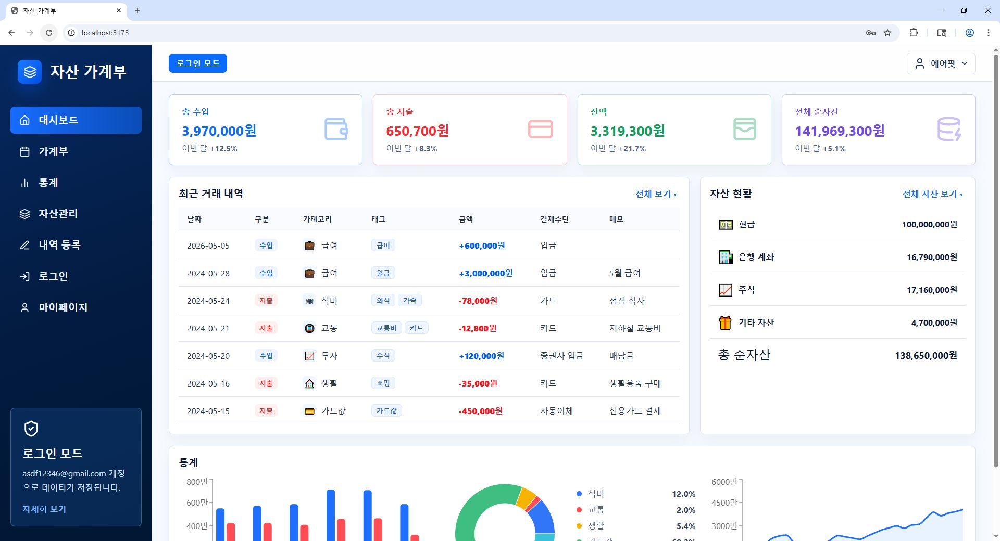
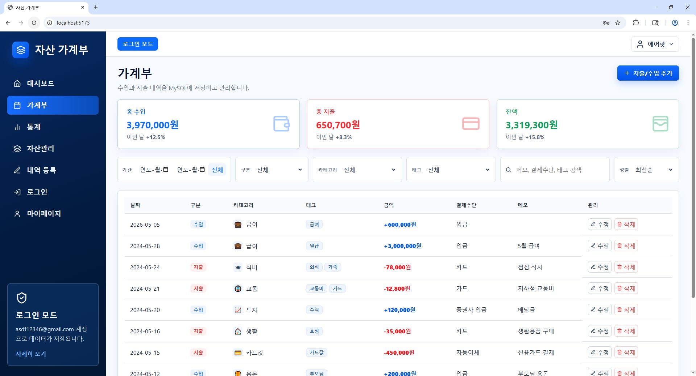
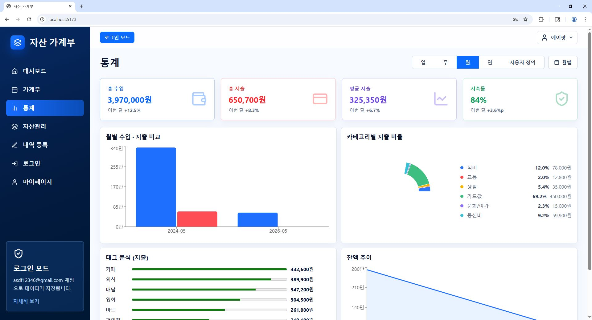
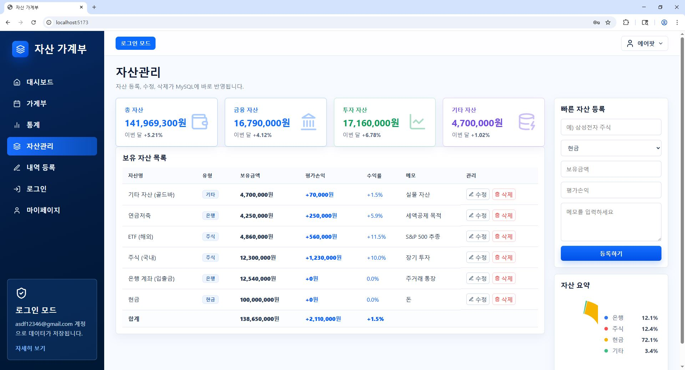
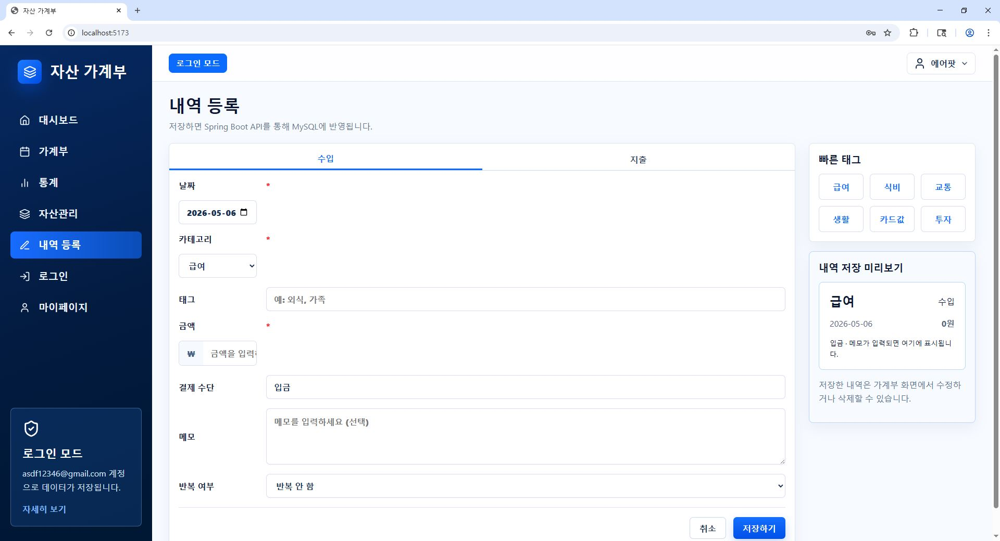
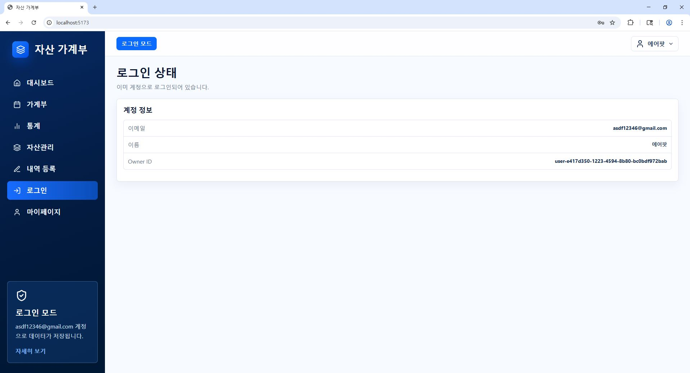
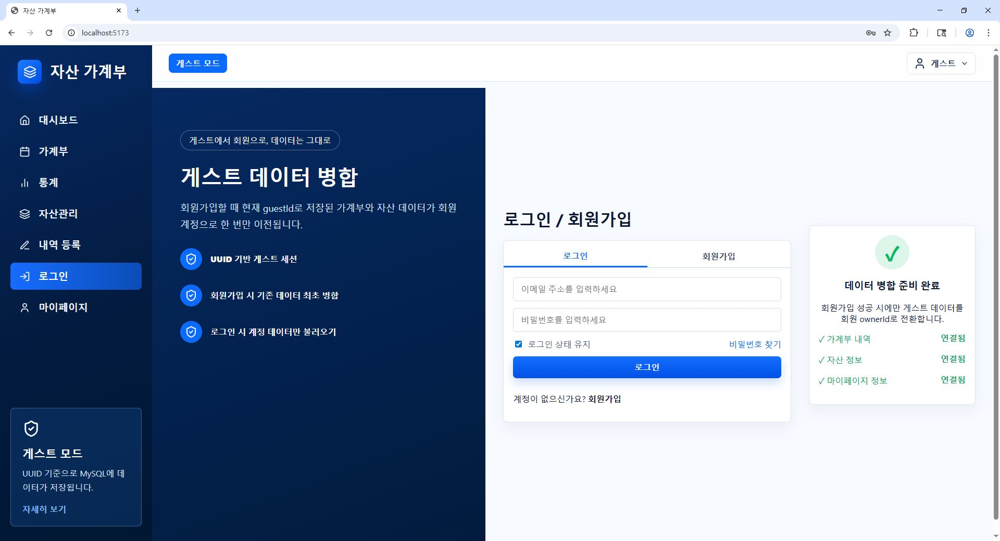
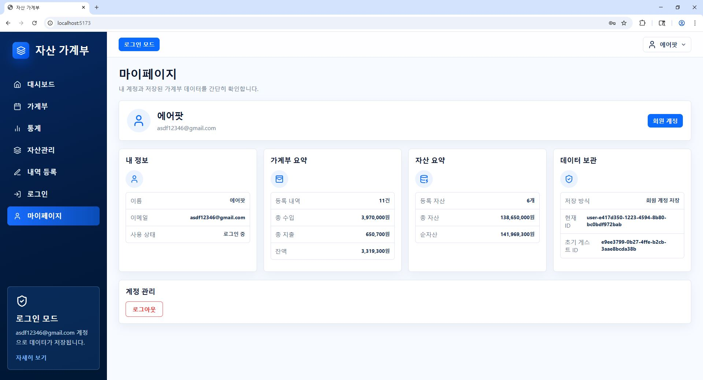
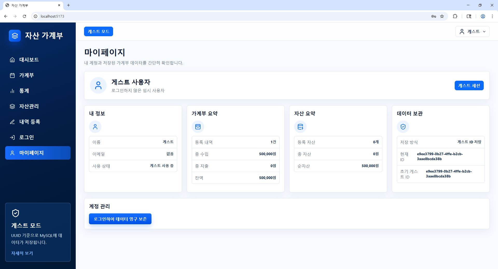

# 자산 가계부

> React와 Spring Boot 기반의 **개인 자산 및 가계부 통합 관리 웹 서비스**입니다.  
> 수입·지출 내역과 현금, 은행 계좌, 주식, 기타 자산을 한 곳에서 관리하고, 통계 차트를 통해 개인 재무 흐름을 직관적으로 확인할 수 있습니다.

<br />

## 프로젝트 소개

**자산 가계부**는 단순히 수입과 지출만 기록하는 가계부가 아니라, 사용자의 전체 자산 현황까지 함께 관리할 수 있도록 설계한 풀스택 웹 서비스입니다.

사용자는 수입과 지출 내역을 등록하고, 카테고리와 태그를 부여하여 내역을 체계적으로 관리할 수 있습니다. 또한 현금, 은행 계좌, 주식, 기타 자산을 등록하여 전체 순자산을 확인할 수 있으며, 월별 통계와 카테고리별 지출 비율, 잔액 추이 등을 차트로 확인할 수 있습니다.

로그인하지 않은 사용자도 UUID 기반 게스트 모드로 서비스를 이용할 수 있으며, 회원가입 또는 로그인 후에는 기존 게스트 데이터를 회원 계정으로 병합하여 계속 사용할 수 있습니다.

<br />

## 기술 스택

### Frontend

| 기술 | 설명 |
|---|---|
| React | SPA 기반 사용자 화면 구현 |
| TypeScript | 정적 타입 기반 프론트엔드 개발 |
| Vite | 빠른 개발 환경 구성 |
| Axios | 백엔드 REST API 통신 |
| Chart Library | 수입·지출 및 자산 통계 시각화 |

### Backend

| 기술 | 설명 |
|---|---|
| Java | 백엔드 개발 언어 |
| Spring Boot | REST API 서버 구현 |
| Spring Data JPA | 데이터베이스 접근 계층 구현 |
| MySQL | 수입·지출, 자산, 사용자 데이터 저장 |
| JWT | 로그인 사용자 인증 처리 |

<br />

## 주요 기능

### 1. 대시보드

- 총 수입, 총 지출, 잔액, 전체 순자산 요약
- 최근 거래 내역 확인
- 자산 현황 확인
- 월별 수입·지출 비교 차트
- 카테고리별 지출 비율 확인
- 잔액 추이 확인



<br />

### 2. 가계부 관리

- 수입 및 지출 내역 조회
- 기간, 구분, 카테고리, 태그별 필터링
- 메모, 결제수단, 태그 검색
- 최신순 정렬
- 내역 수정 및 삭제
- 총 수입, 총 지출, 잔액 자동 계산



<br />

### 3. 통계 분석

- 일 / 주 / 월 / 연 / 사용자 정의 기간별 통계 조회
- 총 수입, 총 지출, 평균 지출, 저축률 확인
- 월별 수입·지출 비교
- 카테고리별 지출 비율 분석
- 태그별 지출 분석
- 잔액 추이 시각화



<br />

### 4. 자산관리

- 현금, 은행, 주식, 기타 자산 등록
- 보유 자산 목록 조회
- 자산 수정 및 삭제
- 전체 자산 합계 계산
- 금융 자산, 투자 자산, 기타 자산 구분 표시
- 자산별 평가손익 및 수익률 관리



<br />

### 5. 내역 등록

- 수입 / 지출 탭 분리
- 날짜, 카테고리, 태그, 금액, 결제수단, 메모 입력
- 빠른 태그 선택 기능
- 저장 전 내역 미리보기 제공
- 저장 시 Spring Boot API를 통해 MySQL에 반영



<br />

### 6. 로그인 상태 확인

- 로그인된 사용자 정보 확인
- 이메일, 이름, Owner ID 표시
- 로그인 모드 상태 표시
- 로그인 사용자 데이터는 계정 기준으로 저장



<br />

### 7. 로그인 / 회원가입 및 게스트 데이터 병합

- 로그인 및 회원가입 화면 제공
- UUID 기반 게스트 세션 지원
- 회원가입 시 기존 게스트 데이터 최초 병합
- 로그인 후 회원 계정 데이터만 불러오기
- 가계부 내역, 자산 정보, 마이페이지 정보 병합 준비 상태 표시



<br />

### 8. 회원 마이페이지

- 회원 사용자 정보 확인
- 가계부 요약 확인
- 자산 요약 확인
- 데이터 보관 방식 확인
- 로그아웃 기능 제공



<br />

### 9. 게스트 마이페이지

- 게스트 사용자 정보 확인
- 게스트 ID 기반 데이터 저장 상태 표시
- 가계부 요약 및 자산 요약 확인
- 로그인하여 데이터 영구 보존 기능 제공



<br />

## 시스템 구조

```text
Frontend(React + TypeScript)
        |
        | REST API 요청 / 응답
        v
Backend(Spring Boot)
        |
        | JPA
        v
Database(MySQL)
```

<br />

## 데이터 처리 흐름

```text
사용자 입력
   ↓
React Form 입력값 관리
   ↓
Axios를 통한 REST API 요청
   ↓
Spring Boot Controller
   ↓
Service 계층 비즈니스 로직 처리
   ↓
Repository 계층 데이터 접근
   ↓
MySQL 저장 및 조회
   ↓
React 화면에 결과 반영
```

<br />

## 핵심 구현 포인트

### UUID 기반 게스트 모드

비로그인 사용자는 최초 접속 시 브라우저에 UUID가 생성됩니다. 해당 UUID를 기준으로 가계부와 자산 데이터가 저장되며, 사용자는 회원가입 없이도 서비스를 체험할 수 있습니다.

```text
guestId 생성 → localStorage 저장 → API 요청 시 guestId 전달 → MySQL에 guestId 기준 데이터 저장
```

### 게스트 데이터 병합

게스트 사용자가 회원가입 또는 로그인을 진행하면 기존 guestId로 저장된 데이터가 회원 계정의 ownerId로 이전됩니다. 이를 통해 가입 전 작성한 데이터가 사라지지 않고 회원 계정에 유지됩니다.

```text
게스트 데이터 조회 → 회원 계정 생성 또는 로그인 → guestId 데이터 ownerId 변경 → 회원 데이터로 병합
```

### REST API 기반 분리 구조

프론트엔드와 백엔드를 분리하여 개발하였으며, React는 화면과 사용자 입력을 담당하고 Spring Boot는 데이터 처리와 비즈니스 로직을 담당합니다.

<br />

## 주요 화면 구성

| 화면 | 설명 |
|---|---|
| 대시보드 | 전체 수입, 지출, 잔액, 순자산 및 최근 거래 확인 |
| 가계부 | 수입·지출 내역 조회, 필터링, 수정, 삭제 |
| 통계 | 기간별 통계, 카테고리별 비중, 태그 분석, 잔액 추이 |
| 자산관리 | 현금, 은행, 주식, 기타 자산 등록 및 관리 |
| 내역 등록 | 수입·지출 내역 입력 및 저장 |
| 로그인 | 회원 로그인, 회원가입, 게스트 데이터 병합 |
| 마이페이지 | 사용자 정보, 데이터 요약, 저장 방식 확인 |

<br />

## 프로젝트를 통해 학습한 점

- React와 Spring Boot를 분리한 풀스택 웹 서비스 구조 설계
- REST API 기반 프론트엔드·백엔드 통신 구현
- MySQL과 JPA를 활용한 데이터 저장 및 조회
- 수입·지출, 자산, 사용자 데이터를 연결하는 데이터 모델 설계
- UUID 기반 게스트 세션과 회원 데이터 병합 로직 구현
- 차트를 활용한 재무 데이터 시각화
- 실제 서비스와 유사한 화면 구성 및 사용자 흐름 설계

<br />

## 실행 방법

### Frontend 실행

```bash
cd frontend
npm install
npm run dev
```

<br />

## 프로젝트 특징

이 프로젝트는 단순 CRUD 기능만 구현한 것이 아니라, 실제 서비스에 가까운 사용자 흐름을 고려하여 설계했습니다.

- 로그인 없이 사용할 수 있는 게스트 모드
- 회원가입 후 게스트 데이터 병합
- 수입·지출 관리와 자산관리 통합
- 통계 차트를 통한 시각적 분석
- React SPA와 Spring Boot REST API 분리 구조
- MySQL 기반 데이터 저장

<br />

## 향후 개선 사항

- 예산 설정 및 예산 초과 알림 기능 추가
- 반복 수입·지출 자동 등록 기능 고도화
- 자산별 수익률 자동 계산 기능 개선
- 엑셀 내보내기 및 가져오기 기능 추가
- 모바일 반응형 UI 개선
- 배포 환경 구성 및 CI/CD 적용

<br />

## 프로젝트 목적

본 프로젝트는 졸업논문 및 포트폴리오 목적으로 제작한 개인 자산 및 가계부 통합 관리 웹 서비스입니다. 프론트엔드, 백엔드, 데이터베이스, 인증, 통계 시각화 기능을 종합적으로 구현하여 실무형 풀스택 개발 역량을 보여주는 것을 목표로 합니다.
